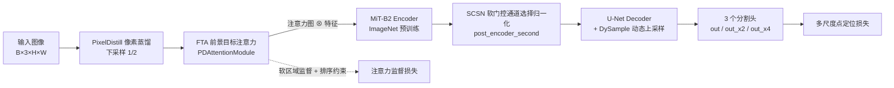
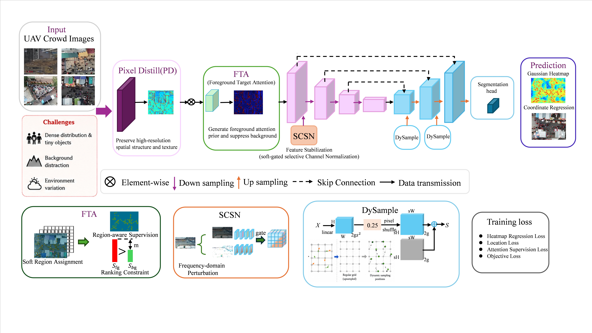
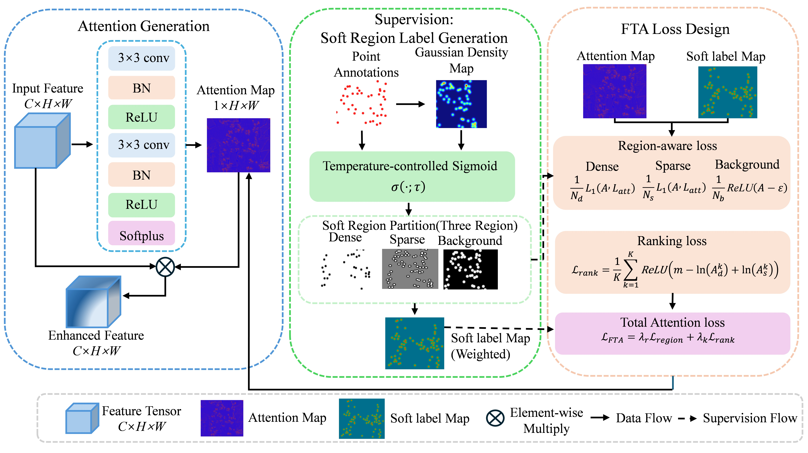
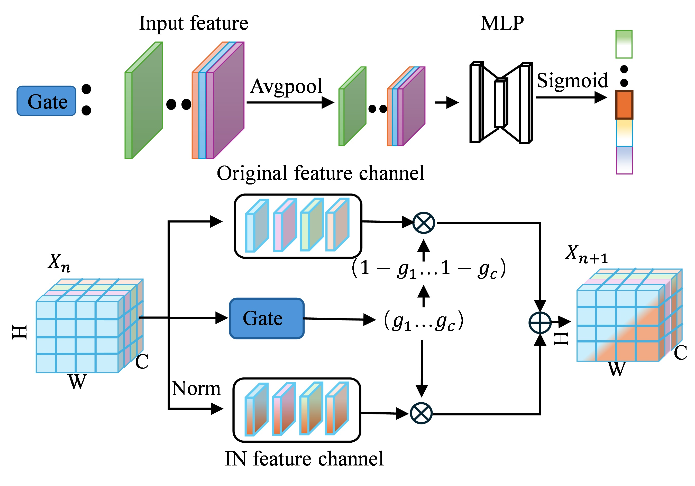

# FocalGen

### A Foreground-Aware Robust Representation Learning Framework for UAV Crowd Localization

[](LICENSE)
[](https://www.python.org/)
[](https://pytorch.org/)
[](https://lightning.ai/)
[](https://developer.nvidia.com/cuda-toolkit)

> 官方 PyTorch 实现

## 🔍 项目简介
无人机（UAV）航拍人群定位是公共安全监控、城市人群管理、应急响应等场景的核心基础任务。针对航拍图像中行人目标极小、背景干扰严重、光照变化剧烈导致特征表征鲁棒性差、定位精度低的问题，本文提出了 **FocalGen** 前景感知鲁棒表征学习框架。
该框架从**空间维度前景增强**和**通道维度光照归一化**两个维度协同优化，在复杂背景与多变光照条件下实现精准的无人机人群点定位。

### 🏆 核心结果速览

| 数据集 | 指标 | Uav-Dot (Baseline) | FocalGen (Ours) | 提升 |
| --- | --- | --- | --- | --- |
| DroneCrowd | L-mAP | 51.00% | **54.57%** | +3.57% |
| DroneCrowd | L-AP@20 | 62.29% | **67.24%** | +4.95% |
| UP-COUNT | L-mAP | 66.49% | **68.96%** | +2.47% |
| UP-COUNT | L-AP@20 | 81.16% | **84.82%** | +3.66% |
| 自建数据集（跨场景） | L-mAP | 16.37% | **25.63%** | **+9.26%** |
| 自建数据集（跨场景） | L-R@10 | 36.08% | **49.95%** | **+13.87%** |

完整对比与消融实验见[实验结果](#-实验结果)。

## ✨ 核心创新点
1. **前景目标注意力模块（Foreground Target Attention, FTA）**
   - 基于高斯密度先验生成连续软区域监督标签，通过温度控制的 Sigmoid 函数实现稠密区、稀疏区、背景区的平滑过渡
   - 结合区域感知损失与排序约束损失，强化目标峰值响应、抑制背景伪峰，同时保留高斯热图的连续梯度特性

2. **软门控通道选择归一化模块（Soft-gated Channel Selective Normalization, SCSN）**
   - 采用连续可微的软门控机制，自适应学习每个通道的归一化强度
   - 结合频域光照扰动与一致性训练策略，缓解光照变化导致的特征分布漂移，同时保留判别性语义信息

3. **分阶段协同训练策略**
   - 先训练空间前景增强，再训练通道光照稳定，最后联合微调
   - 搭配 DySample 动态上采样恢复空间细节，降低模块间的优化冲突，实现稳定收敛

## 🧠 方法概览

FocalGen 以 **MiT-B2 + U-Net** 点定位网络为基线，从「空间维度的前景增强」和「通道维度的光照归一化」两条路径协同提升复杂背景与多变光照下的人群定位鲁棒性。



<p align="center">
  
</p>

<p align="center"><em>图 1：FocalGen 整体网络架构。</em></p>

### 1️⃣ FTA：前景目标注意力模块（`src/model/dot_model.py` → `PDAttentionModule`）

- **注意力生成**：在 PixelDistill 输出的低分辨率特征上，用轻量卷积（3 → 16 → 32）+ 1×1 卷积 + `Softplus` 生成单通道注意力图，输出范围不受限，避免人为截断。
- **软区域监督**：以高斯密度热图为先验，用温度系数 $T=5$ 的 Sigmoid 构造**连续可微**的三区域软标签：
  - 密集区：$\sigma(T(\rho - \tau_{dense}))$，回归到 $[1.2, 1.6]$ 的放大区间；
  - 稀疏区：介于两个阈值之间的过渡带，回归到 $[0.8, 1.2]$；
  - 背景区：$1-\sigma(T(\rho-\tau_{sparse}))$，用 $\mathrm{ReLU}(a - 0.1)$ 抑制背景响应。
- **排序约束损失**：随机采样高/低密度像素对，使用对数间隔的 hinge 排名损失，强制 $a_{dense} > a_{sparse}$，从而"强化目标峰值、抑制背景伪峰"。
- **损失权重**：默认 $1.5$（密集）/ $1.5$（稀疏）/ $0.2$（背景）/ $0.1$（排序），可通过 `adaptive_weight=True` 切换为可学习权重。
- **注意力作用方式**：`multiply`（直接相乘）或 `adaptive`（按注意力强度动态缩放）。

<p align="center">
  
</p>

<p align="center"><em>图 2：FTA 前景目标注意力模块。</em></p>

### 2️⃣ SCSN：软门控通道选择归一化（`src/model/CSNorm.py`）

- 每个通道门控 $g \in [0,1]$ 由 `GAP → 1×1 Conv(C→C/4) → ReLU → Dropout(0.1) → 1×1 Conv(C/4→C) → Sigmoid` 生成，连续可微，无需硬阈值；
- 输出为软插值：$y = (1-g)\cdot x + g \cdot \mathrm{InstanceNorm}(x)$，等价于"自适应决定每个通道是否执行光照归一化"；
- 通过 `csnorm_positions` 选择插入位置，当前模型实现支持 **`post_encoder_second`**（编码器第 2 阶段特征之后）；
- 训练阶段配合**频域 lightness 扰动**（`lightness_perturbation.py`，对 FFT 幅度做随机缩放）与参数冻结策略，缓解光照变化引起的特征分布漂移。

<p align="center">
  
</p>

<p align="center"><em>图 3：SCSN 软门控通道选择归一化模块。</em></p>

### 3️⃣ 分阶段协同训练 + DySample

- **多尺度主损失**：`main_loss = loss_x2 + 0.7 * loss_x4 + 0.3 * loss_x8`（三个分辨率的分割头）；
- **注意力联合损失**：`loss = main_loss + 0.1 * attention_loss`（`attention_loss` 权重由 `pd_attention_loss_weight` 控制）；
- **CSNorm 专项阶段**：`csnorm_training_mode: freeze_all` 时冻结除 SCSN 外的全部参数、学习率降为 0.1 倍，训练 `csnorm_epochs` 轮后完成通道维稳定化；
- **DySample**（`src/model/dysample.py`）在解码器上采样阶段做内容自适应的点采样，恢复小目标的边界与峰值细节。

---

## 📁 项目结构

```
FocalGen/
├── main.py                          # 训练 / 验证 / 测试主入口（Hydra + PyTorch Lightning）
├── pt_pred.py                       # 测试集批量推理与预测可视化
├── infer_video.py                   # 视频推理（逐帧检测，导出结果视频与坐标 txt）
├── configs/
│   ├── dronecrowd.yaml              # DroneCrowd / 自建数据配置（DySample + SCSN + FTA）
│   └── upcount.yaml                 # UP-COUNT 数据集配置
├── src/
│   ├── datamodule/
│   │   ├── dot_datamodule.py        # LightningDataModule：数据划分、增强、DataLoader
│   │   └── dataset/
│   │       ├── generic_dataset.py       # 数据集基类（缩放、mosaic、归一化）
│   │       ├── dronecrowd_dataset.py    # DroneCrowd（.mat 标注）
│   │       ├── upcount_dataset.py       # UP-COUNT（.txt 标注 + 飞行高度）
│   │       ├── merged_pixel_dataset.py  # 通用像素坐标数据（jpg + txt）
│   │       └── mask_generator.py        # UMich 高斯热图 / 峰值标签生成
│   ├── losses/
│   │   ├── dot_loss.py              # 总损失：0.25·NLL + 1.0·obj + 2.0·reg
│   │   ├── negative_loss.py         # CenterNet 风格负样本（focal）损失
│   │   ├── dot_detection_loss.py    # 目标置信度损失 + 位置回归损失
│   │   └── regression_loss.py       # 回归损失
│   ├── metric/
│   │   ├── detection_f1.py          # 定位 F1 / Precision / Recall（默认 5px 匹配半径）
│   │   └── counting.py              # 计数 MAE / 归一化 MAE
│   └── model/
│       ├── dot_model.py             # 主网络：PixelDistill + FTA + MiT-B2 + U-Net 解码器
│       ├── dot_regressor.py         # LightningModule：损失、优化器、指标、后处理（NMS + 阈值）
│       ├── CSNorm.py                # SCSN 软门控通道选择归一化模块
│       ├── dysample.py              # DySample 动态上采样算子
│       └── lightness_perturbation.py# 频域 lightness 扰动
├── data/                            # 预测结果分析 / 对比脚本
├── eval_tool/                       # DroneCrowd 官方评测工具（Git submodule）
├── assets/                          # README 配图（架构图、模块图）
├── requirements.txt
└── LICENSE
```

---

## 📦 环境依赖

- 操作系统：Linux / Windows
- Python >= 3.8
- PyTorch == 2.1.0（CUDA 11.8）
- 硬件：NVIDIA GPU（推荐 24GB 显存及以上，如 RTX 4090）

核心依赖（完整列表见 [`requirements.txt`](requirements.txt)）：

| 依赖 | 版本 |
| --- | --- |
| torch / torchvision | 2.1.0 / 0.16.0 |
| pytorch-lightning | 2.1.3 |
| segmentation-models-pytorch | 0.3.4 |
| timm | 0.9.7 |
| albumentations | 1.0.3 |
| opencv-python | 4.5.5.64 |
| hydra-core | 1.3.2 |
| torchmetrics | 1.2.0 |
| numpy | 1.26.4 |

安装依赖：

```bash
conda create -n focalgen python=3.8 -y
conda activate focalgen
pip install torch==2.1.0 torchvision==0.16.0 --index-url https://download.pytorch.org/whl/cu118
pip install -r requirements.txt
```

> 仓库通过 Git submodule 引入 DroneCrowd 官方评测工具 `eval_tool`，克隆时请使用
> `git clone --recursive <repo-url>`，或在克隆后执行 `git submodule update --init --recursive`。

---

## 🗂️ 数据准备

`src/datamodule/dot_datamodule.py` 内置三种数据集格式，通过配置项 `dataset` 切换。

**1. `merged_yolo_pixel`（通用像素坐标格式，配置见 `configs/dronecrowd.yaml`）**

图像与点标注一一对应，图像全部作为测试集使用：

```
<data_path>/
├── images/
│   ├── dataset1_frame_00001.jpg
│   └── ...
└── ground_truth/
    ├── dataset1_frame_00001.txt    # 每行：x y（像素坐标，空格/换行分隔）
    └── ...
```

**2. `dronecrowd`（DroneCrowd 数据集）**

```
<data_path>/
├── train_data/
│   ├── images/          # img_*.jpg
│   └── ground_truth/    # GT_img_*.mat（image_info：x, y, ...）
├── val_data/
│   ├── images/
│   └── ground_truth/
└── test_data/
    ├── images/
    └── ground_truth/
```

**3. `upcount`（UP-COUNT 数据集，配置见 `configs/upcount.yaml`）**

```
<data_path>/
├── images/<sequence>/*.jpg        # 文件名以 __<飞行高度>.jpg 结尾
├── labels/<sequence>/*.txt        # 每行：x y
├── train.txt                      # 训练序列名列表
├── val.txt
└── test.txt
```

> 所有数据格式只需给出**点标注**，训练时由 `mask_generator.py` 在线生成 UMich 高斯热图（峰值标签 + 密度标签）。

---

## 🚀 训练

项目使用 Hydra 管理配置，配置文件位于 `configs/`，因此需要显式指定 `--config-name`：

```bash
# 训练 DroneCrowd / 自建数据（MIT-B2 + DySample + SCSN + FTA 全量配置）
python main.py --config-name=dronecrowd data_path=/path/to/dataset

# 训练 UP-COUNT
python main.py --config-name=upcount data_path=/path/to/UP-COUNT
```

命令行可覆盖任意配置项：

```bash
python main.py --config-name=dronecrowd \
    data_path=/path/to/dataset \
    image_size=[1920,1088] mask_size=[960,544] \
    batch_size=4 lr=4e-4 epochs=100 \
    use_dysample=True use_csnorm=True use_pd_attention=True \
    devices=1 precision=32
```

从已有权重继续训练（仅加载权重，不恢复优化器状态）：

```bash
python main.py --config-name=dronecrowd restore_from_ckpt=/path/to/ckpt.ckpt
```

训练时的主要组件：

| 组件 | 设置 |
| --- | --- |
| 优化器 | `AdamW(lr, weight_decay=1e-4)` |
| 学习率调度 | `LinearLR` 500 步 warmup + `CosineAnnealingWarmRestarts(T_0=train_steps//4, T_mult=2, eta_min=1e-8)` |
| 梯度累积 | 4 |
| 梯度裁剪 | `gradient_clip_val=0.7` |
| 早停 | `EarlyStopping(monitor=val_f1, mode=max, patience=20)` |
| 模型保存 | `ModelCheckpoint(monitor=val_f1, filename='epoch_{epoch}-f1_{val_f1:.2f}')`，同时保存 `last` |
| 日志 | CSVLogger（默认）+ NeptuneLogger（`debug=False` 时启用，需自行配置 API Token） |

训练输出（`checkpoints/`、`outputs/`、`results/`）已加入 `.gitignore`。

---

## 🧪 测试与推理

**1. 在测试集上评估**

```bash
# 直接加载权重测试（test_only）
python main.py --config-name=dronecrowd \
    test_only=True \
    restore_from_ckpt=/path/to/ckpt.ckpt
```

输出指标：`test_f1` / `test_P` / `test_R` / `test_mae` / `test_mae_norm`。

**2. 批量推理与可视化**

```bash
python pt_pred.py --config-name=dronecrowd \
    restore_from_ckpt=/path/to/ckpt.ckpt \
    viz=True
```

在测试集上逐帧推理，将 GT 点（绿色）与预测点（红色）叠加绘制，结果保存到 `./results/viz/`。

**3. 视频推理**

```bash
python infer_video.py --config-name=dronecrowd \
    restore_from_ckpt=/path/to/ckpt.ckpt \
    +video=/path/to/video.mp4
```

输出：

- `./infer_results/pred_<video_name>.avi`：标注了预测点的结果视频
- `./infer_results/pred_<video_name>.txt`：逐帧坐标，格式为 `frame_id,x,y`

**4. 结果分析脚本（`data/`）**

| 脚本 | 作用 |
| --- | --- |
| `analyze_correct_compare.py` | 对比不同版本预测与 GT 的匹配情况，输出 recall / precision / F1 / 平均匹配距离，定位变好与变差的帧 |
| `analyze_viz_compare.py` | 两版预测结果的可视化对比 |
| `analyze_viz_probe.py` | 单帧预测探针可视化 |

> 这些脚本中的路径为占位示例（`BASE` / `GT_DIR` 等常量），使用前请改为本地实际路径。

---

## 📊 评价指标

| 指标 | 实现 | 说明 |
| --- | --- | --- |
| F1 / Precision / Recall | `src/metric/detection_f1.py` | 预测点与 GT 点做最近邻匹配，距离阈值默认 **5 px**，同一 GT 只匹配一个预测点 |
| MAE / MAE_norm | `src/metric/counting.py` | 逐图计数误差及其按行人数归一化的版本 |
| L-mAP / L-AP@k | `eval_tool/` | 定位 mAP 及阈值 k ∈ {10, 15, 20} px 下的 AP，由 DroneCrowd 官方评测工具（子模块）计算，论文中报告的是该组指标 |
| L-P@k / L-R@k | `eval_tool/` | 阈值 k px 下的定位精度（Precision）与召回率（Recall） |

后处理流程：`Sigmoid` → 3×3 max-pool 局部极大值抑制（NMS）→ 以 `obj_threshold`（默认 0.2）为阈值提取峰值点 → 映射回原图坐标。

---

## ⚙️ 配置项速查

| 配置项 | 说明 | 默认值 |
| --- | --- | --- |
| `data_path` | 数据集根目录 | — |
| `dataset` | 数据集类型：`merged_yolo_pixel` / `dronecrowd` / `upcount` | — |
| `data_fold` | 交叉验证折数，`-1` 表示使用默认划分 | `-1` |
| `image_size` / `mask_size` | 网络输入尺寸 / 热图尺寸（`[W, H]`） | `[1920,1088]` / `[960,544]` |
| `encoder_name` | 编码器骨干 | `mit_b2` |
| `spatial_mode` | 下采样方式：`pixel`（PixelDistill）/ `interpolate` / `none` | `pixel` |
| `loss` | 损失函数：`dot` / `mse` | `dot` |
| `batch_size` / `lr` | 批大小 / 学习率 | `4` / `4e-4` |
| `obj_threshold` | 峰值提取阈值 | `0.2` |
| `mosaic` | Mosaic 增强概率 | `0.8` |
| `use_dysample` | 启用 DySample 动态上采样 | `False` |
| `use_dynamic_conv` | 使用动态卷积替换普通卷积 | `False` |
| `use_pd_attention`（FTA） | 启用前景目标注意力 | `False` |
| `pd_attention_mode` | 注意力作用方式：`multiply` / `adaptive` | `multiply` |
| `pd_attention_dense_thresh` / `pd_attention_sparse_thresh` | 密集区 / 稀疏区密度阈值 | `0.3` / `0.01` |
| `pd_attention_loss_weight` | 注意力损失权重 | `0.1` |
| `use_csnorm`（SCSN） | 启用软门控通道选择归一化 | `False` |
| `csnorm_positions` | SCSN 插入位置（当前支持 `post_encoder_second`） | `['pre', 'post_encoder', 'post_encoder_second']` |
| `csnorm_training_mode` | 训练模式：`freeze_all`（冻结主干）/ `fine_tune` | `freeze_all` |
| `csnorm_epochs` | SCSN 专项训练轮数 | `50` |
| `epochs` / `es_patience` | 训练轮数 / 早停耐心值 | `100` / `20` |
| `monitor` / `monitor_mode` | 监控指标 / 方向 | `val_f1` / `max` |
| `precision` | 训练精度 | `32` |
| `devices` | GPU 数量，`<=0` 使用 `auto` | `1` |
| `debug` | 调试模式（关闭 NeptuneLogger 与可视化） | `False` |
| `test_only` | 仅执行测试 | `False` |

---

## 📈 实验结果

> 所有结果均在**原始分辨率图像**上评测，指标为 L-mAP 与 L-AP@k（k 为匹配距离阈值，单位像素），由 DroneCrowd 官方评测工具 [`eval_tool/`](eval_tool) 计算。

### 1. 与 SOTA 方法的对比（DroneCrowd）

| Method | L-mAP | L-AP@10 | L-AP@15 | L-AP@20 |
| --- | --- | --- | --- | --- |
| CSRNet | 14.40% | 9.81% | 11.81% | 12.83% |
| STNNet | 40.45% | 42.75% | 50.98% | 55.77% |
| P2PNet | 29.44% | 17.76% | 38.42% | 52.71% |
| MFA | 43.43% | 47.14% | 51.58% | 54.02% |
| STEERER | 38.31% | 41.96% | 46.58% | 49.07% |
| RFLA | 32.05% | 34.41% | 39.59% | 42.52% |
| RE-DETR | 39.22% | 41.27% | 50.36% | 54.66% |
| SD-DETR | 48.12% | 52.56% | 57.35% | 60.08% |
| YOLO11m | 42.79% | 46.49% | 51.25% | 54.32% |
| YOLO26m | 42.61% | 45.96% | 51.15% | 54.45% |
| Uav-Dot (Baseline) | 51.00% | 57.06% | 60.45% | 62.29% |
| **FocalGen (Ours)** | **54.57%** | **60.34%** | **64.80%** | **67.24%** |

相较于 Uav-Dot 基线，FocalGen 在 DroneCrowd 上 L-mAP 提升 **+3.57%**，L-AP@10 / @15 / @20 分别提升 **+3.28% / +4.35% / +4.95%**，并全面超越表中所有对比方法。

### 2. 与 Baseline 的对比（UP-COUNT）

| Method | L-mAP | L-AP@10 | L-AP@15 | L-AP@20 |
| --- | --- | --- | --- | --- |
| Uav-Dot (Baseline) | 66.49% | 75.46% | 79.57% | 81.16% |
| **FocalGen (Ours)** | **68.96%** | **78.20%** | **83.08%** | **84.82%** |

在更高分辨率（3840×2176）的 UP-COUNT 上，L-mAP 提升 **+2.47%**，L-AP@10 / @15 / @20 分别提升 **+2.74% / +3.51% / +3.66%**。

### 3. 真实场景跨场景泛化（自建无人机数据集）

为验证模型在**未见场景**下的泛化能力，我们在新采集的无人机航拍数据集（`merged_yolo_pixel` 格式）上做了直接迁移测试（不微调）。

| Method | L-mAP | L-AP@10 | L-AP@15 | L-AP@20 | L-P@10 | L-R@10 |
| --- | --- | --- | --- | --- | --- | --- |
| UAV-Dot | 16.37% | 16.56% | 18.76% | 20.61% | **34.81%** | 36.08% |
| **FocalGen (Ours)** | **25.63%** | **25.84%** | **29.43%** | **32.34%** | 31.75% | **49.95%** |

跨场景迁移场景下增益更为显著：

- **L-mAP 从 16.37% 提升至 25.63%（+9.26%，相对提升 56.6%）**，L-AP@10 / @15 / @20 分别提升 **+9.28% / +10.67% / +11.73%**；
- **召回率 L-R@10 从 36.08% 提升至 49.95%（+13.87%，相对提升 38.4%）**，说明 FTA 的前景峰值增强与 SCSN 的光照归一化确实提升了模型对陌生场景的适应能力；
- 精度 L-P@10 略有下降（34.81% → 31.75%，-3.06%），即模型在提高召回的同时会多报少量假阳性——这是跨场景泛化中常见的查全-查准权衡，但 mAP 与 AP@k 的全面提升表明整体定位质量是提升的。

> **观察：** 对比域内结果（DroneCrowd +3.57%），跨域场景下 FocalGen 的增益（+9.26%）反而更大，说明所提模块学习的是与场景无关的鲁棒表征，而非对训练域过拟合。


### 4. 核心模块消融实验（DroneCrowd）

`✓` 表示启用该模块；Uav-Dot 基线（无任何模块）的 L-mAP 为 51.00%。

| FTA | SCSN | DySample | L-mAP | L-AP@10 | L-AP@15 | L-AP@20 |
| :---: | :---: | :---: | --- | --- | --- | --- |
| ✓ | | | 52.58% | 58.81% | 63.23% | 65.58% |
| | ✓ | | 52.57% | 58.63% | 62.35% | 64.47% |
| | | ✓ | 52.88% | 58.54% | 62.75% | 65.00% |
| ✓ | ✓ | | 53.21% | 59.54% | 63.87% | 66.19% |
| ✓ | | ✓ | 53.47% | 59.23% | 63.49% | 65.81% |
| | ✓ | ✓ | 54.02% | 59.73% | 64.08% | 66.46% |
| ✓ | ✓ | ✓ | **54.57%** | **60.34%** | **64.80%** | **67.24%** |

结论：

- 三个模块单独使用即可带来 +1.6% ~ +1.9% 的 L-mAP 增益，说明空间前景增强、通道光照归一化与动态上采样三条路径均有效；
- SCSN 与 DySample 组合（54.02%）增益最大，二者在通道稳定性与空间细节恢复上互补；
- 三者协同使用时取得最佳性能（54.57%），且 L-AP@20 相比基线提升近 5 个百分点，验证了模块间良好的互补性。

预训练权重：*（待发布）*

---

## ⚠️ 注意事项

- `configs/*.yaml` 中的 `data_path`、`restore_from_ckpt` 为作者本地绝对路径，请在使用前修改；
- SCSN 当前仅在 `post_encoder_second` 位置生效，配置其他位置不会插入模块；
- 启用 `use_csnorm` 且 `csnorm_training_mode='freeze_all'` 时，训练轮数由 `csnorm_epochs` 决定（而非 `epochs`）；
- 启用 SCSN 时学习率会自动乘以 0.1，属于通道归一化专项训练策略。

---

## 📝 引用

如果本工作对你的研究有帮助，请引用：

```bibtex
@article{focalgen,
  title   = {FocalGen: A Foreground-Aware Robust Representation Learning Framework for UAV Crowd Localization},
  author  = {Anonymous},
  journal = {To be updated},
  year    = {2025}
}
```

---

## 🙏 致谢

本项目的部分实现参考了以下开源工作，特此致谢：

- [segmentation_models_pytorch](https://github.com/qubvel/segmentation_models.pytorch)：编码器 / 解码器与分割头实现
- [DySample](https://github.com/tiny-smart/dysample)：动态上采样算子
- [CenterNet](https://github.com/xingyizhou/CenterNet)：负样本（focal）损失
- [yolov7](https://github.com/WongKinYiu/yolov7)：检测损失中的匹配与回归策略
- [DroneCrowd-VID-toolkit-python](https://github.com/up-count/DroneCrowd-VID-toolkit-python)：官方评测工具

---

## 📄 许可证

本项目基于 [Apache License 2.0](LICENSE) 发布。
